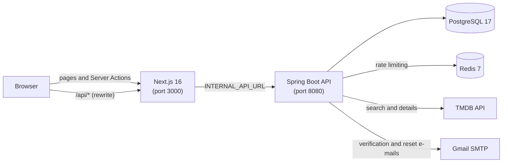
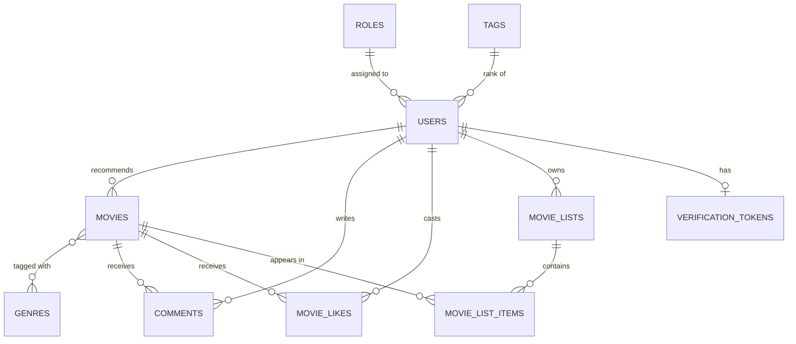

<div align="center">

**English** | [Türkçe](README.tr.md)

# Moviva

**A movie recommendation and community platform.**
Discover films, recommend your favourites with a personal note, vote, comment and curate your own lists.


</div>

<p align="center">
  
</p>

---

## Table of contents

- [About](#about)
- [Screenshots](#screenshots)
- [Features](#features)
- [Tech stack](#tech-stack)
- [Architecture](#architecture)
- [Project structure](#project-structure)
- [Getting started](#getting-started)
  - [Option A: Docker Compose](#option-a-docker-compose-full-stack)
  - [Option B: Local development](#option-b-local-development)
  - [Environment variables](#environment-variables)
  - [Demo account](#demo-account)
- [API overview](#api-overview)
- [Frontend routes](#frontend-routes)
- [Data model](#data-model)
- [Security](#security)
- [Testing](#testing)
- [Roadmap](#roadmap)
- [Author](#author)

---

## About

Moviva is a full-stack web application built around one simple idea: **people trust movie recommendations from other people**.

Instead of an algorithmic feed, every film on Moviva was added by a community member who recommended it and explained why. Movie metadata (poster, director, genres, runtime, rating and so on) is pulled from [TMDB](https://www.themoviedb.org/), so a recommendation takes only a search and a short note.

The project is split into two deployable parts:

- **`backend/`**: a stateless REST API built with Spring Boot, secured with JWT, backed by PostgreSQL and Redis.
- **`frontend/`**: a server-rendered Next.js application (App Router, Server Components and Server Actions). The UI is in Turkish.

## Screenshots

<table>
  <tr>
    <td width="50%" align="center" valign="top">
      
      <br><sub><b>Browse films by genre, with film counts in the sidebar</b></sub>
    </td>
    <td width="50%" align="center" valign="top">
      
      <br><sub><b>Film details with votes and an “add to list” button</b></sub>
    </td>
  </tr>
  <tr>
    <td width="50%" align="center" valign="top">
      
      <br><sub><b>The recommender's note and the comment section</b></sub>
    </td>
    <td width="50%" align="center" valign="top">
      
      <br><sub><b>Recommend a film: search TMDB (films already on Moviva are flagged)</b></sub>
    </td>
  </tr>
  <tr>
    <td width="50%" align="center" valign="top">
      
      <br><sub><b>Explain why others should watch it</b></sub>
    </td>
    <td width="50%" align="center" valign="top">
      
      <br><sub><b>A personal list with total films, average rating and total runtime</b></sub>
    </td>
  </tr>
  <tr>
    <td colspan="2" align="center" valign="top">
      
      <br><sub><b>Profile page with activity stats and your lists</b></sub>
    </td>
  </tr>
</table>

## Features

**Discovery**
- Browse the latest recommendations or the most-liked films, with genre filtering and pagination
- Genre sidebar with a film count per genre
- Search across the films already on the platform
- Film detail pages with backdrop, director, country, rating, genres, tagline and IMDb id
- SEO-ready pages: per-page metadata, Open Graph / Twitter cards and JSON-LD structured data

**Recommendations**
- Search TMDB, pick a film and add a personal note (10 to 2000 characters)
- Film details and credits are fetched from TMDB and stored locally; duplicates are rejected
- Recommenders can edit their note later
- Recommenders earn a point every time someone likes a film they recommended, and every user carries a rank tag (default: *Yeni Üye*)

**Community**
- Like / dislike voting (click again to undo, click the other button to switch)
- Comments with a spoiler flag; authors can edit and delete their own comments
- Unique view tracking for signed-in users (one view per user, per film, per hour)

**Movie lists**
- Create, rename and delete personal lists, each with a public / private flag
- Add and remove films, with paginated list contents
- Per-list statistics: total films, average rating and total runtime

**Accounts and security**
- Registration with e-mail verification (24-hour link)
- Login with an HttpOnly JWT cookie (7-day lifetime)
- Forgot / reset password by e-mail (15-minute link)
- Profile and settings pages, with account and password updates
- Role-based access control, BCrypt password hashing, bean validation
- Redis-backed rate limiting: a global limit plus per-endpoint limits

## Tech stack

| Layer | Technology |
| --- | --- |
| **Backend** | Java 17, Spring Boot 3.5 (Web, Security, Data JPA, Validation, AOP, Mail, Data Redis), Hibernate, MapStruct, Lombok, JJWT, springdoc-openapi (Swagger UI) |
| **Frontend** | Next.js 16 (App Router, Server Components, Server Actions, React Compiler), React 19, Tailwind CSS 4, Framer Motion, React Hook Form + Zod, Axios, React Toastify, React Icons |
| **Database** | PostgreSQL 17 (schema managed by Hibernate `ddl-auto=update`) |
| **Redis** | Redis 7 (rate limiting; JSON cache manager configured with a 60-minute TTL) |
| **External services** | TMDB API (movie data, `tr-TR`), Gmail SMTP (transactional e-mail) |
| **Tooling** | Docker and Docker Compose, Maven Wrapper, ESLint, JUnit 5 + Mockito, pgAdmin 4 |

## Architecture



How a request flows:

1. Server Components and Server Actions call the backend directly through `INTERNAL_API_URL`, forwarding the `token` cookie.
2. Browser-side calls (Axios) go to `NEXT_PUBLIC_API_URL`. Next.js rewrites `/api/:path*` to the backend, so the browser can talk to the API from the same origin.
3. The backend authenticates every request from the JWT (cookie first, `Authorization: Bearer` as a fallback), applies the rate-limit filters and then reaches the service layer.
4. When someone recommends a film, the backend fetches its details and credits from TMDB and stores a local copy.

## Project structure

```text
Moviva/
├── docker-compose.yml          # Full stack: postgres, redis, pgadmin, backend, frontend
├── .env.example                # Variables for docker-compose
├── backend/                    # Spring Boot API (Java 17, Maven)
│   ├── compose.yml             # Infra only (postgres, redis, pgadmin) for local development
│   ├── Dockerfile
│   └── src/main/java/com/filmonersene/website/
│       ├── annotation/         # @RateLimit
│       ├── aspect/             # RateLimitAspect (per-endpoint limits, Redis)
│       ├── config/             # Security, Redis, TMDB client, data seeding
│       ├── controllers/        # REST controllers
│       ├── dtos/               # Request / response models
│       ├── entities/           # JPA entities
│       ├── exceptions/         # Custom exceptions + GlobalExceptionHandler
│       ├── mapper/             # MapStruct mappers
│       ├── repositories/       # Spring Data JPA repositories
│       ├── security/           # JWT filter, JwtUtil, global rate-limit filter
│       └── services/           # abstracts/ (interfaces) and concretes/ (implementations)
└── frontend/                   # Next.js application (App Router)
    ├── Dockerfile
    └── src/
        ├── app/                # Routes (arama, filmler, film-detay, liste, profil, ayarlar, ...)
        ├── actions/            # Server Actions (auth, movies, comments)
        ├── api/                # Axios client and browser-side API calls
        ├── components/         # UI, layout, movie, list, auth, hero and featured sections
        ├── lib/                # Server-only fetch client, auth status, data loaders
        ├── schemas/            # Zod validation schemas
        └── proxy.js            # Protects /profil and /ayarlar, clears expired tokens
```

## Getting started

### Prerequisites

| Tool | Needed for |
| --- | --- |
| [Docker](https://docs.docker.com/get-docker/) with Compose | Option A (and the infra containers in Option B) |
| JDK 17 | Running the backend locally |
| Node.js 22 | Running the frontend locally (matches the Docker image) |
| A [TMDB API key](https://developer.themoviedb.org/docs/getting-started) | Movie search and recommendations |
| A Gmail account with an [app password](https://support.google.com/accounts/answer/185833) | Verification and password-reset e-mails |

### Option A: Docker Compose (full stack)

```bash
git clone https://github.com/emrecan15/Moviva.git
cd Moviva

# 1. Variables for docker-compose (see the table below)
cp .env.example .env

# 2. Variables for the Next.js build (see the note below)
cp frontend/.env.example frontend/.env

# 3. Build and start everything
docker compose up -d --build
```

| Service | URL |
| --- | --- |
| Frontend | http://localhost:3000 |
| Backend API | http://localhost:8080/api |
| Swagger UI | http://localhost:8080/swagger-ui.html |
| pgAdmin | http://localhost:5050 |

> **Note on the frontend build.** Next.js inlines `NEXT_PUBLIC_*` variables (and the `rewrites()` destination in `next.config.mjs`) when the image is built, and the frontend Dockerfile does not take build arguments. Fill in `frontend/.env` **before** running `docker compose up --build`. For the Compose network use `INTERNAL_API_URL=http://backend:8080/api`.

To stop the stack: `docker compose down` (add `-v` to also delete the database volume).

### Option B: Local development

**1. Start PostgreSQL, Redis and pgAdmin**

```bash
cd backend
docker compose -f compose.yml up -d
```

This starts PostgreSQL (database `moviva`, user `postgres`), Redis and pgAdmin with the throwaway credentials defined in `backend/compose.yml`.

**2. Run the backend**

```bash
cd backend
cp .env.example .env    # then fill it in
```

Spring Boot reads these values as **operating-system environment variables** (`application.properties` uses `${DB_URL}` and friends, and there is no `.env` loader), so export them before starting the app:

```bash
# macOS / Linux / Git Bash
set -a; source .env; set +a
./mvnw spring-boot:run
```

```powershell
# Windows PowerShell
Get-Content .env | ForEach-Object { if ($_ -match '^\s*([^#=]+)=(.*)$') { [Environment]::SetEnvironmentVariable($matches[1].Trim(), $matches[2].Trim()) } }
.\mvnw.cmd spring-boot:run
```

Using an IDE (Eclipse, STS, IntelliJ)? Add the same variables to your run configuration instead.

The API is now available at `http://localhost:8080`, with Swagger UI at `/swagger-ui.html`. On the first start Hibernate creates the schema and the app seeds the default role, the default tag and a demo user.

**3. Run the frontend**

```bash
cd frontend
cp .env.example .env    # then fill it in
npm install
npm run dev
```

Open http://localhost:3000.

### Environment variables

Suggested values for a local setup:

#### Root `.env` (used by `docker-compose.yml`)

| Variable | Description | Example |
| --- | --- | --- |
| `POSTGRES_DB` / `POSTGRES_USER` / `POSTGRES_PASSWORD` | Database name and credentials | `moviva` / `moviva` / *a strong password* |
| `PGADMIN_EMAIL` / `PGADMIN_PASSWORD` | pgAdmin login | `admin@example.com` / *a strong password* |
| `JWT_SECRET_KEY` | HS256 signing secret, **at least 32 characters** | `openssl rand -base64 48` |
| `MAIL_USERNAME` / `MAIL_PASSWORD` | Gmail address and app password | |
| `FRONTEND_URL` | Public URL of the frontend (CORS and reset links) | `http://localhost:3000` |
| `BACKEND_BASE_URL` | Public URL of the API **including `/api`** (used to build the e-mail verification link `…/auth/verify?token=…`) | `http://localhost:8080/api` |
| `TMDB_BASE_URL` | TMDB API base URL | `https://api.themoviedb.org/3` |
| `TMDB_API_KEY` | Your TMDB v3 API key | |

#### `backend/.env` (local development)

| Variable | Description | Example |
| --- | --- | --- |
| `DB_URL` | JDBC URL | `jdbc:postgresql://localhost:5432/moviva` |
| `DB_USERNAME` / `DB_PASSWORD` | Database credentials | see `backend/compose.yml` |
| `JWT_SECRET_KEY` | HS256 signing secret (32+ characters) | |
| `MAIL_USERNAME` / `MAIL_PASSWORD` | Gmail SMTP (`smtp.gmail.com:587`, STARTTLS) | |
| `REDIS_HOST` / `REDIS_PORT` | Redis connection | `localhost` / `6379` |
| `FRONTEND_URL` | Frontend origin | `http://localhost:3000` |
| `BACKEND_BASE_URL` | API URL including `/api` | `http://localhost:8080/api` |
| `TMDB_BASE_URL` / `TMDB_API_KEY` | TMDB settings | `https://api.themoviedb.org/3` / *your key* |

The cookie `secure` flag is controlled by `app.security.secure-cookie` in `application.properties` (default `false`). Set it to `true` when serving over HTTPS.

#### `frontend/.env`

| Variable | Description | Example |
| --- | --- | --- |
| `NEXT_PUBLIC_SITE_URL` | Canonical site URL for metadata | `http://localhost:3000` |
| `HOSTNAME` / `PORT` | Server bind address and port | `0.0.0.0` / `3000` |
| `NEXT_PUBLIC_API_URL` | API base URL used by browser-side Axios calls. Pointing it at the frontend origin plus `/api` goes through the Next.js rewrite (same origin, no CORS) | `http://localhost:3000/api` |
| `INTERNAL_API_URL` | API base URL used by Server Components / Actions and by the rewrite | `http://localhost:8080/api` (`http://backend:8080/api` in Docker) |
| `ORIGIN_URL` | Frontend origin (`allowedDevOrigins`) | `http://localhost:3000` |
| `NEXT_PUBLIC_TMDB_MEDIA_URL` | Prefix for TMDB poster paths | `https://image.tmdb.org/t/p/w500` |

### Demo account

On startup the backend seeds a verified demo user so you can try the app without going through e-mail verification:

| E-mail | Password |
| --- | --- |
| `demo@moviva.com` | `Demo1234!` |


## API overview

Base path: `/api`. Interactive documentation is available at **`/swagger-ui.html`**.
Limits are per user (or per IP for anonymous callers) within the given window. Exceeding one returns **HTTP 429**.

### Authentication and users

| Method | Endpoint | Auth | Rate limit | Description |
| --- | --- | :---: | --- | --- |
| `POST` | `/auth/login` | – | 10 / min | Log in; sets the HttpOnly `token` cookie |
| `POST` | `/auth/logout` | – | – | Clear the session cookie |
| `GET` | `/auth/status` | – | – | Current session (email, username, role) |
| `GET` | `/auth/verify?token=` | – | 5 / min | Verify an e-mail address |
| `POST` | `/auth/reset-password` | – | 5 / hour | Request a password-reset e-mail |
| `POST` | `/auth/reset-password/confirm` | – | 7 / 5 min | Set a new password with the emailed token |
| `POST` | `/user/register` | – | 5 / 5 min | Create an account |
| `GET` | `/user/userinfo` | ✔ | – | Profile with recommendation, comment and vote counts |
| `PUT` | `/user/update` | ✔ | 10 / min | Update username and bio |
| `POST` | `/user/change-password` | ✔ | – | Change password |

### Movies, recommendations and comments

| Method | Endpoint | Auth | Rate limit | Description |
| --- | --- | :---: | --- | --- |
| `GET` | `/movies/getRecentlyAddedMovies` | – | – | Newest films (`genre`, `page`, `size`) |
| `GET` | `/movies/getMostLikedMovies` | – | – | Most-liked films (`genre`, `page`, `size`) |
| `GET` | `/movies/{id}` | – | – | Film details, comments and the caller's vote |
| `GET` | `/movies/search?query=` | – | 20 / min | Search TMDB |
| `GET` | `/movies/local-search?query=` | – | 50 / min | Search films stored on Moviva (top 20) |
| `POST` | `/movies/{id}/like` · `/dislike` | ✔ | 20 / min | Toggle a vote |
| `POST` | `/movies/save` | ✔ | 20 / min | Save a film from a request body |
| `GET` | `/genre-stats` | – | – | Genres with film counts |
| `POST` | `/recommendations` | ✔ | 10 / min | Recommend a TMDB film (`tmdbId`, `comment`) |
| `PUT` | `/recommendations/{movieId}` | ✔ | 10 / min | Edit your recommendation note |
| `GET` | `/comments/?movieId=` | – | – | Paginated comments for a film |
| `POST` | `/comments/` | ✔ | 5 / min | Add a comment |
| `PUT` | `/comments/{id}` | ✔ | 10 / min | Edit your comment |
| `DELETE` | `/comments/{id}` | ✔ | 10 / min | Delete your comment |

### Movie lists

| Method | Endpoint | Auth | Rate limit | Description |
| --- | --- | :---: | --- | --- |
| `GET` | `/lists` | ✔ | – | Your lists (paginated) |
| `GET` | `/lists/{listId}` | ✔ | – | List details and statistics |
| `POST` | `/lists` | ✔ | 10 / min | Create a list |
| `PUT` | `/lists/{listId}` | ✔ | 20 / min | Update a list |
| `DELETE` | `/lists/{listId}` | ✔ | 10 / min | Delete a list |
| `GET` | `/lists/{listId}/movies` | ✔ | – | Films in a list (paginated) |
| `POST` | `/lists/{listId}/movies/{movieId}` | ✔ | 30 / min | Add a film |
| `DELETE` | `/lists/{listId}/movies/{movieId}` | ✔ | 30 / min | Remove a film |

On top of the per-endpoint limits, every `/api/*` request is subject to a global limit of **200 requests per minute** per user or IP.

## Frontend routes

| Route | Description | Protected |
| --- | --- | :---: |
| `/` | Home: hero, featured, recent and most-liked films | |
| `/filmler` · `/filmler/[genre]` | All films, optionally filtered by genre | |
| `/en-cok-begenilenler` · `/en-cok-begenilenler/[genre]` | Most-liked films | |
| `/film-detay/[id]` | Film details, votes, recommendation note and comments | |
| `/arama?q=` | Search results | |
| `/liste/[id]` | Movie list details | |
| `/profil` | Profile and your lists | ✔ |
| `/ayarlar` | Account and security settings | ✔ |
| `/sifre-sifirlama?token=` | Password-reset form | |

## Data model



`MovieView` (unique film views) is stored separately and references films and users by id. Unique constraints prevent duplicate votes per user and film (`movie_likes`) and duplicate films per list (`movie_list_items`).

## Security

- **Authentication:** stateless JWT (HS256) stored in an `HttpOnly`, `SameSite=Lax` cookie. An `Authorization: Bearer` header is also accepted.
- **Authorization:** method-level `@PreAuthorize` checks on `USER`, `MODERATOR` and `ADMIN` roles. Ownership is verified in the service layer for comments, recommendations and lists.
- **Passwords:** hashed with BCrypt. Passwords need 8 to 64 characters with an upper-case letter, a lower-case letter, a digit and a special character.
- **Validation:** Jakarta Bean Validation on every request body (usernames 3 to 15 characters, comments 2 to 500 characters, and so on), mirrored in the frontend with Zod.
- **Abuse protection:** Redis-backed global and per-endpoint rate limiting.
- **Account safety:** e-mail verification before login; verification and reset tokens are single-use, and reset links expire after 15 minutes.
- **CORS:** restricted to the configured frontend and backend URLs, with credentials enabled.

## Testing

```bash
# Backend
cd backend
./mvnw test

# Frontend
cd frontend
npm run lint
```

The backend includes 16 Mockito unit tests for `MovieListManager` (create, read, update, delete and ownership rules). `WebsiteApplicationTests` is a full context-load test, so it needs the environment variables and services described above.

## Roadmap

- [ ] Shareable pages for public movie lists
- [ ] Response caching with the existing Redis cache manager
- [ ] Admin / moderator tooling (roles are supported in the security layer)
- [ ] Automatic rank progression based on user points
- [ ] Wider test coverage (services, controllers, frontend) and a CI pipeline
- [ ] Refactoring legacy code
- [ ] A live demo link

## Author

**Emre Can**: [@emrecan15](https://github.com/emrecan15)

Movie data and images are provided by [TMDB](https://www.themoviedb.org/). This product uses the TMDB API but is not endorsed or certified by TMDB.
