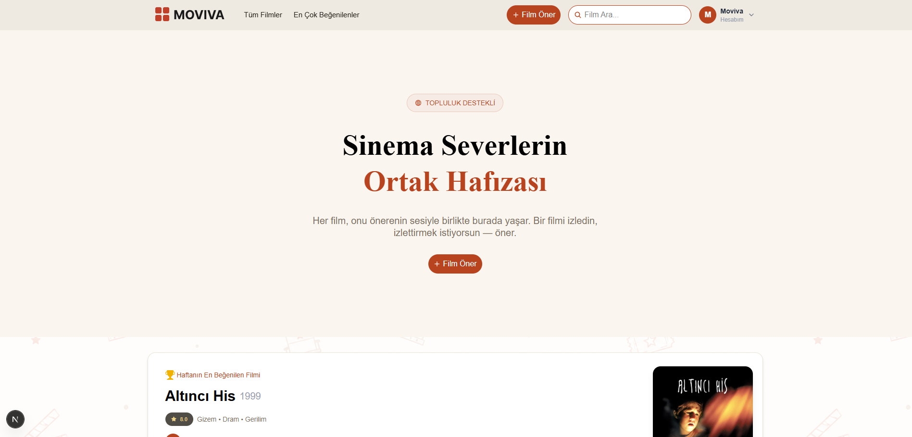
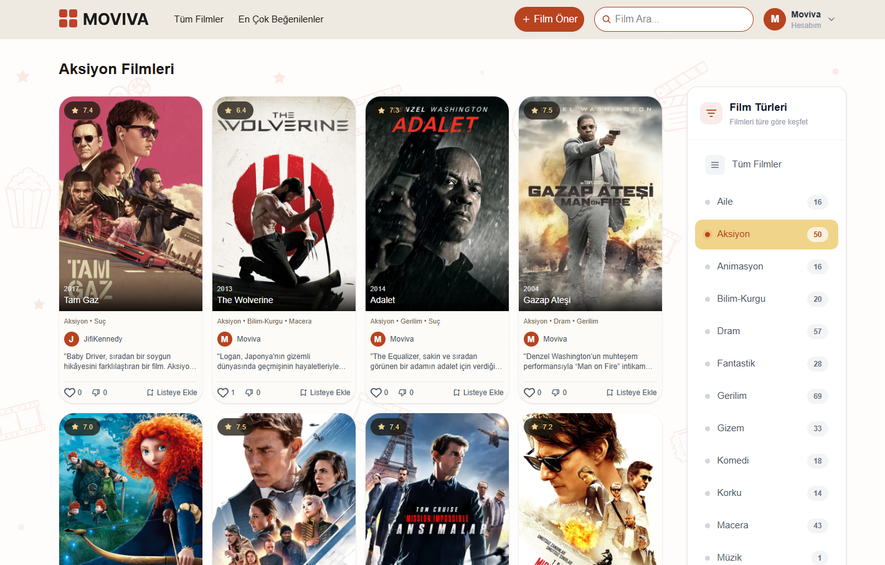
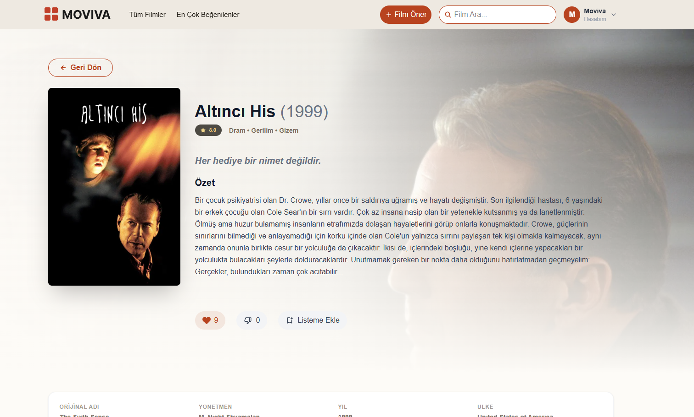
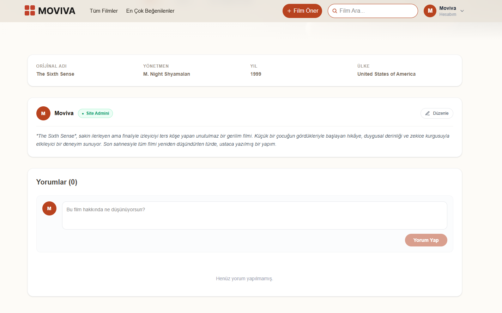
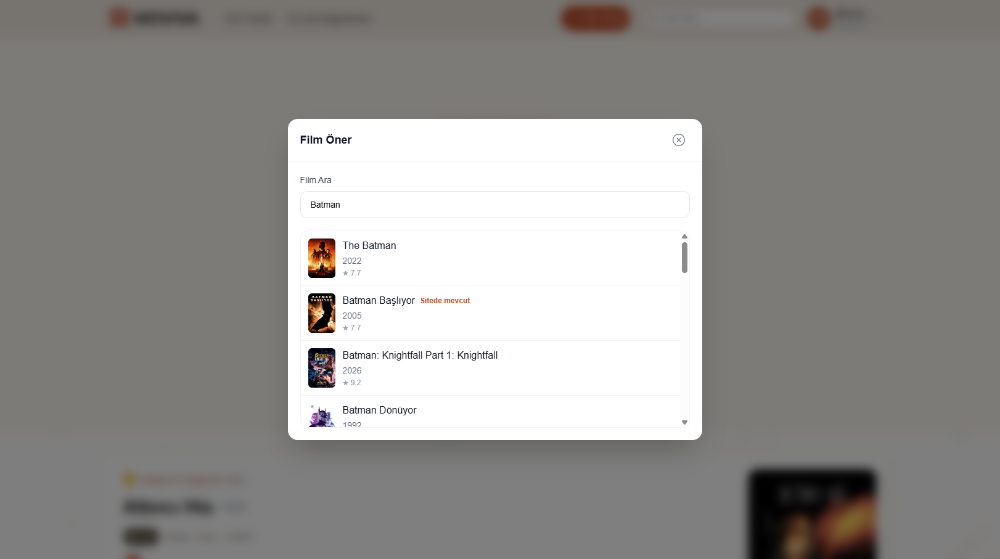
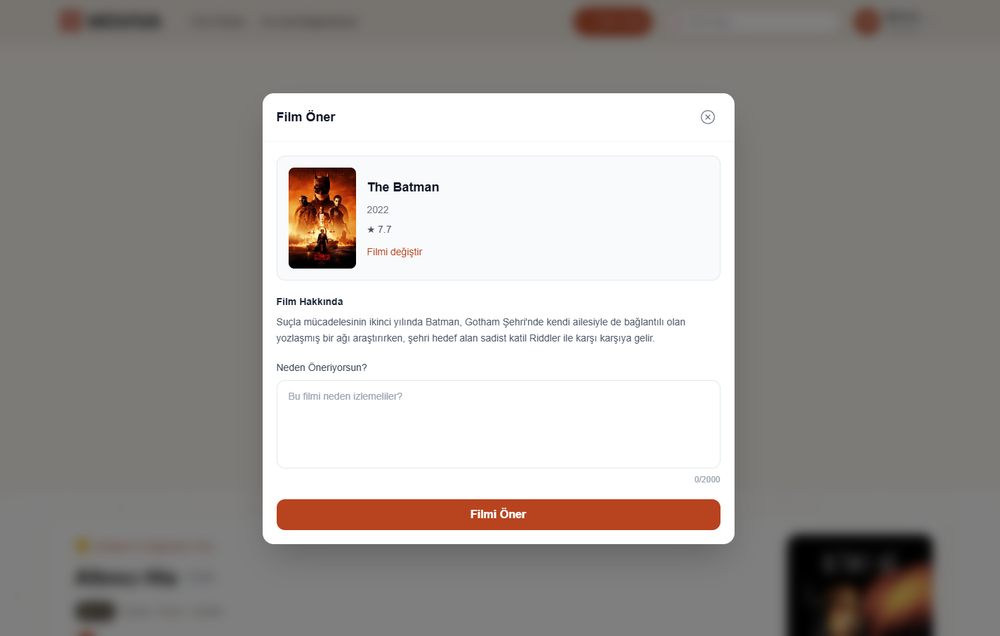
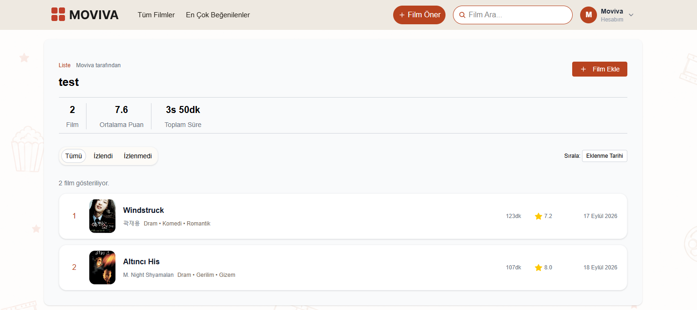
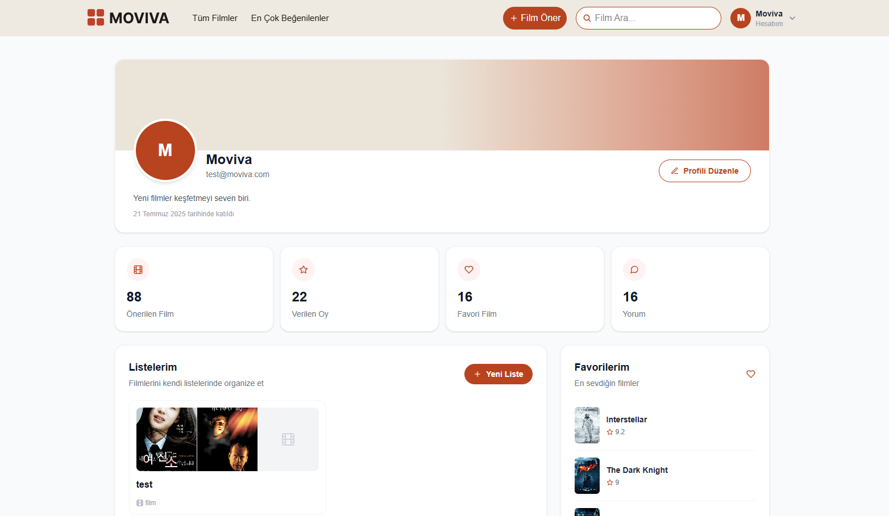
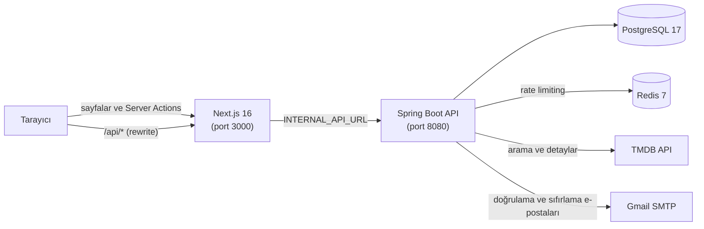
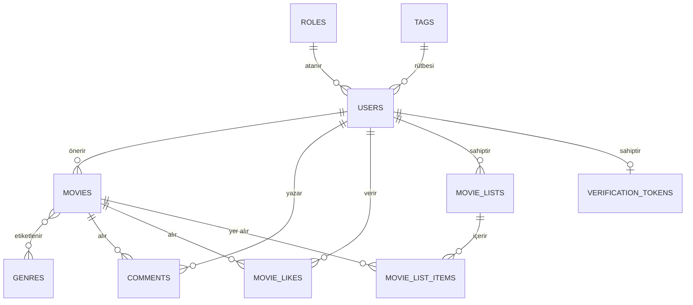

<div align="center">

[English](README.md) | **Türkçe**

# Moviva

**Bir film öneri ve topluluk platformu.**
Filmleri keşfet, favorilerini kişisel bir notla öner, oy ver, yorum yap ve kendi listelerini oluştur.


</div>

<p align="center">
  
</p>

---

## İçindekiler

- [Hakkında](#hakkında)
- [Ekran görüntüleri](#ekran-görüntüleri)
- [Özellikler](#özellikler)
- [Teknoloji yığını](#teknoloji-yığını)
- [Mimari](#mimari)
- [Proje yapısı](#proje-yapısı)
- [Başlarken](#başlarken)
  - [Seçenek A: Docker Compose](#seçenek-a-docker-compose-tüm-yığın)
  - [Seçenek B: Yerel geliştirme](#seçenek-b-yerel-geliştirme)
  - [Ortam değişkenleri](#ortam-değişkenleri)
  - [Demo hesabı](#demo-hesabı)
- [API genel bakış](#api-genel-bakış)
- [Frontend rotaları](#frontend-rotaları)
- [Veri modeli](#veri-modeli)
- [Güvenlik](#güvenlik)
- [Testler](#testler)
- [Yol haritası](#yol-haritası)
- [Yazar](#yazar)

---

## Hakkında

Moviva, basit bir fikir etrafında kurulmuş tam yığın (full-stack) bir web uygulamasıdır: **insanlar film önerilerine, diğer insanlardan geldiğinde daha çok güvenir**.

Algoritmik bir akış yerine, Moviva'daki her film bir topluluk üyesi tarafından eklenmiştir; o kişi filmi önermiş ve nedenini açıklamıştır. Film bilgileri (afiş, yönetmen, türler, süre, puan vb.) [TMDB](https://www.themoviedb.org/) üzerinden çekilir, dolayısıyla bir öneri yapmak için bir arama ve kısa bir not yeterlidir.

Proje iki ayrı parçadan oluşur:

- **`backend/`**: Spring Boot ile yazılmış, JWT ile korunan, PostgreSQL ve Redis destekli, durumsuz (stateless) bir REST API.
- **`frontend/`**: Sunucu tarafında render edilen bir Next.js uygulaması (App Router, Server Components ve Server Actions). Arayüz Türkçedir.

## Ekran görüntüleri

<table>
  <tr>
    <td width="50%" align="center" valign="top">
      
      <br><sub><b>Filmlere türe göre göz atın; kenar çubuğunda tür başına film sayısı</b></sub>
    </td>
    <td width="50%" align="center" valign="top">
      
      <br><sub><b>Oylar ve “Listeme Ekle” butonuyla film detayları</b></sub>
    </td>
  </tr>
  <tr>
    <td width="50%" align="center" valign="top">
      
      <br><sub><b>Öneren kişinin notu ve yorum bölümü</b></sub>
    </td>
    <td width="50%" align="center" valign="top">
      
      <br><sub><b>Film öner: TMDB'de ara (Moviva'da zaten olan filmler işaretlenir)</b></sub>
    </td>
  </tr>
  <tr>
    <td width="50%" align="center" valign="top">
      
      <br><sub><b>Filmin neden izlenmesi gerektiğini anlatın</b></sub>
    </td>
    <td width="50%" align="center" valign="top">
      
      <br><sub><b>Toplam film, ortalama puan ve toplam süre ile kişisel liste</b></sub>
    </td>
  </tr>
  <tr>
    <td colspan="2" align="center" valign="top">
      
      <br><sub><b>Aktivite istatistikleri ve listelerinizle profil sayfası</b></sub>
    </td>
  </tr>
</table>

## Özellikler

**Keşif**
- En son önerilen veya en çok beğenilen filmlere göz atma; tür filtresi ve sayfalama
- Her türün yanında film sayısını gösteren tür kenar çubuğu
- Platformdaki filmler arasında arama
- Arka plan görseli, yönetmen, ülke, puan, türler, slogan ve IMDb kimliği içeren film detay sayfaları
- SEO'ya hazır sayfalar: sayfa başına metadata, Open Graph / Twitter kartları ve JSON-LD yapılandırılmış veri

**Öneriler**
- TMDB'de ara, bir film seç ve kişisel bir not ekle (10 ile 2000 karakter)
- Film detayları ve kadro bilgisi TMDB'den alınıp yerelde saklanır; tekrar eden filmler reddedilir
- Öneriyi yapan kişi notunu sonradan düzenleyebilir
- Önerdiği bir film beğenildikçe öneren kişi puan kazanır; her kullanıcı bir rütbe etiketi taşır (varsayılan: *Yeni Üye*)

**Topluluk**
- Beğen / beğenme oylaması (tekrar tıklayınca geri alınır, diğer butona tıklayınca oy değişir)
- Spoiler işaretli yorumlar; yazarlar kendi yorumlarını düzenleyip silebilir
- Giriş yapmış kullanıcılar için tekil görüntülenme takibi (kullanıcı başına, film başına, saatte bir)

**Film listeleri**
- Kişisel listeler oluşturma, yeniden adlandırma ve silme; her listede herkese açık / özel bayrağı
- Filmleri ekleme ve çıkarma; sayfalanmış liste içeriği
- Liste başına istatistikler: toplam film sayısı, ortalama puan ve toplam süre

**Hesaplar ve güvenlik**
- E-posta doğrulamalı kayıt (24 saat geçerli bağlantı)
- HttpOnly JWT çerezi ile giriş (7 gün geçerli)
- E-posta ile şifremi unuttum / sıfırlama (15 dakika geçerli bağlantı)
- Hesap ve şifre güncellemeli profil ve ayarlar sayfaları
- Rol tabanlı erişim kontrolü, BCrypt ile şifre hashleme, bean validation
- Redis destekli rate limiting: global limit ve endpoint bazlı limitler

## Teknoloji yığını

| Katman | Teknoloji |
| --- | --- |
| **Backend** | Java 17, Spring Boot 3.5 (Web, Security, Data JPA, Validation, AOP, Mail, Data Redis), Hibernate, MapStruct, Lombok, JJWT, springdoc-openapi (Swagger UI) |
| **Frontend** | Next.js 16 (App Router, Server Components, Server Actions, React Compiler), React 19, Tailwind CSS 4, Framer Motion, React Hook Form + Zod, Axios, React Toastify, React Icons |
| **Veritabanı** | PostgreSQL 17 (şema Hibernate `ddl-auto=update` ile yönetilir) |
| **Redis** | Redis 7 (rate limiting; 60 dakika TTL'li JSON cache manager yapılandırılmış) |
| **Dış servisler** | TMDB API (film verisi, `tr-TR`), Gmail SMTP (işlem e-postaları) |
| **Araçlar** | Docker ve Docker Compose, Maven Wrapper, ESLint, JUnit 5 + Mockito, pgAdmin 4 |

## Mimari



Bir istek nasıl ilerler:

1. Server Components ve Server Actions, `INTERNAL_API_URL` üzerinden backend'i doğrudan çağırır ve `token` çerezini iletir.
2. Tarayıcı tarafı çağrılar (Axios) `NEXT_PUBLIC_API_URL` adresine gider. Next.js `/api/:path*` isteklerini backend'e yeniden yazar (rewrite); böylece tarayıcı API ile aynı origin üzerinden konuşabilir.
3. Backend her isteği JWT'den doğrular (önce çerez, yedek olarak `Authorization: Bearer`), rate limit filtrelerini uygular ve ardından servis katmanına ulaşır.
4. Biri bir film önerdiğinde backend film detaylarını ve kadrosunu TMDB'den çekip yerel bir kopyasını saklar.

## Proje yapısı

```text
Moviva/
├── docker-compose.yml          # Tüm yığın: postgres, redis, pgadmin, backend, frontend
├── .env.example                # docker-compose değişkenleri
├── backend/                    # Spring Boot API (Java 17, Maven)
│   ├── compose.yml             # Yerel geliştirme için sadece altyapı (postgres, redis, pgadmin)
│   ├── Dockerfile
│   └── src/main/java/com/filmonersene/website/
│       ├── annotation/         # @RateLimit
│       ├── aspect/             # RateLimitAspect (endpoint bazlı limitler, Redis)
│       ├── config/             # Güvenlik, Redis, TMDB istemcisi, başlangıç verileri
│       ├── controllers/        # REST controller'ları
│       ├── dtos/               # İstek / yanıt modelleri
│       ├── entities/           # JPA entity'leri
│       ├── exceptions/         # Özel exception'lar + GlobalExceptionHandler
│       ├── mapper/             # MapStruct mapper'ları
│       ├── repositories/       # Spring Data JPA repository'leri
│       ├── security/           # JWT filtresi, JwtUtil, global rate limit filtresi
│       └── services/           # abstracts/ (arayüzler) ve concretes/ (uygulamalar)
└── frontend/                   # Next.js uygulaması (App Router)
    ├── Dockerfile
    └── src/
        ├── app/                # Rotalar (arama, filmler, film-detay, liste, profil, ayarlar, ...)
        ├── actions/            # Server Actions (auth, movies, comments)
        ├── api/                # Axios istemcisi ve tarayıcı tarafı API çağrıları
        ├── components/         # UI, layout, film, liste, auth, hero ve öne çıkan bölümler
        ├── lib/                # Sadece sunucuda çalışan fetch istemcisi, oturum durumu, veri yükleyiciler
        ├── schemas/            # Zod doğrulama şemaları
        └── proxy.js            # /profil ve /ayarlar'ı korur, süresi dolmuş token'ları temizler
```

## Başlarken

### Gereksinimler

| Araç | Ne için gerekli |
| --- | --- |
| [Docker](https://docs.docker.com/get-docker/) ve Compose | Seçenek A (ve Seçenek B'deki altyapı konteynerleri) |
| JDK 17 | Backend'i yerelde çalıştırmak |
| Node.js 22 | Frontend'i yerelde çalıştırmak (Docker imajıyla aynı sürüm) |
| Bir [TMDB API anahtarı](https://developer.themoviedb.org/docs/getting-started) | Film arama ve öneriler |
| [Uygulama şifresi](https://support.google.com/accounts/answer/185833) olan bir Gmail hesabı | Doğrulama ve şifre sıfırlama e-postaları |

### Seçenek A: Docker Compose (tüm yığın)

```bash
git clone https://github.com/emrecan15/Moviva.git
cd Moviva

# 1. docker-compose değişkenleri (aşağıdaki tabloya bakın)
cp .env.example .env

# 2. Next.js build değişkenleri (aşağıdaki nota bakın)
cp frontend/.env.example frontend/.env

# 3. Her şeyi derle ve başlat
docker compose up -d --build
```

| Servis | URL |
| --- | --- |
| Frontend | http://localhost:3000 |
| Backend API | http://localhost:8080/api |
| Swagger UI | http://localhost:8080/swagger-ui.html |
| pgAdmin | http://localhost:5050 |

> **Frontend build'i hakkında not.** Next.js, imaj derlenirken `NEXT_PUBLIC_*` değişkenlerini (ve `next.config.mjs` içindeki `rewrites()` hedefini) koda gömer; frontend Dockerfile'ı ise build argümanı almaz. Bu yüzden `frontend/.env` dosyasını `docker compose up --build` komutundan **önce** doldurun. Compose ağı için `INTERNAL_API_URL=http://backend:8080/api` kullanın.

Yığını durdurmak için: `docker compose down` (veritabanı volume'ünü de silmek için `-v` ekleyin).

### Seçenek B: Yerel geliştirme

**1. PostgreSQL, Redis ve pgAdmin'i başlatın**

```bash
cd backend
docker compose -f compose.yml up -d
```

Bu komut PostgreSQL'i (veritabanı `moviva`, kullanıcı `postgres`), Redis'i ve pgAdmin'i `backend/compose.yml` içinde tanımlı geçici (throwaway) kimlik bilgileriyle başlatır.

**2. Backend'i çalıştırın**

```bash
cd backend
cp .env.example .env    # sonra doldurun
```

Spring Boot bu değerleri **işletim sistemi ortam değişkenleri** olarak okur (`application.properties` içinde `${DB_URL}` gibi ifadeler var ve bir `.env` yükleyicisi yok), bu yüzden uygulamayı başlatmadan önce değişkenleri export etmeniz gerekir:

```bash
# macOS / Linux / Git Bash
set -a; source .env; set +a
./mvnw spring-boot:run
```

```powershell
# Windows PowerShell
Get-Content .env | ForEach-Object { if ($_ -match '^\s*([^#=]+)=(.*)$') { [Environment]::SetEnvironmentVariable($matches[1].Trim(), $matches[2].Trim()) } }
.\mvnw.cmd spring-boot:run
```

IDE kullanıyorsanız (Eclipse, STS, IntelliJ) aynı değişkenleri çalıştırma yapılandırmasına (run configuration) ekleyin.

API artık `http://localhost:8080` adresinde, Swagger UI ise `/swagger-ui.html` altında çalışır. İlk açılışta Hibernate şemayı oluşturur; uygulama varsayılan rolü, varsayılan etiketi ve bir demo kullanıcıyı ekler.

**3. Frontend'i çalıştırın**

```bash
cd frontend
cp .env.example .env    # sonra doldurun
npm install
npm run dev
```

http://localhost:3000 adresini açın.

### Ortam değişkenleri

Yerel kurulum için önerilen değerler:

#### Kök `.env` (`docker-compose.yml` tarafından kullanılır)

| Değişken | Açıklama | Örnek |
| --- | --- | --- |
| `POSTGRES_DB` / `POSTGRES_USER` / `POSTGRES_PASSWORD` | Veritabanı adı ve kimlik bilgileri | `moviva` / `moviva` / *güçlü bir şifre* |
| `PGADMIN_EMAIL` / `PGADMIN_PASSWORD` | pgAdmin girişi | `admin@example.com` / *güçlü bir şifre* |
| `JWT_SECRET_KEY` | HS256 imza anahtarı, **en az 32 karakter** | `openssl rand -base64 48` |
| `MAIL_USERNAME` / `MAIL_PASSWORD` | Gmail adresi ve uygulama şifresi | |
| `FRONTEND_URL` | Frontend'in herkese açık URL'si (CORS ve sıfırlama bağlantıları) | `http://localhost:3000` |
| `BACKEND_BASE_URL` | API'nin herkese açık URL'si, **`/api` dahil** (e-posta doğrulama bağlantısını `…/auth/verify?token=…` oluşturmak için kullanılır) | `http://localhost:8080/api` |
| `TMDB_BASE_URL` | TMDB API taban URL'si | `https://api.themoviedb.org/3` |
| `TMDB_API_KEY` | TMDB v3 API anahtarınız | |

#### `backend/.env` (yerel geliştirme)

| Değişken | Açıklama | Örnek |
| --- | --- | --- |
| `DB_URL` | JDBC URL'si | `jdbc:postgresql://localhost:5432/moviva` |
| `DB_USERNAME` / `DB_PASSWORD` | Veritabanı kimlik bilgileri | `backend/compose.yml` dosyasına bakın |
| `JWT_SECRET_KEY` | HS256 imza anahtarı (32+ karakter) | |
| `MAIL_USERNAME` / `MAIL_PASSWORD` | Gmail SMTP (`smtp.gmail.com:587`, STARTTLS) | |
| `REDIS_HOST` / `REDIS_PORT` | Redis bağlantısı | `localhost` / `6379` |
| `FRONTEND_URL` | Frontend origin'i | `http://localhost:3000` |
| `BACKEND_BASE_URL` | `/api` dahil API URL'si | `http://localhost:8080/api` |
| `TMDB_BASE_URL` / `TMDB_API_KEY` | TMDB ayarları | `https://api.themoviedb.org/3` / *anahtarınız* |

Çerezin `secure` bayrağı `application.properties` içindeki `app.security.secure-cookie` ile kontrol edilir (varsayılan `false`). HTTPS üzerinden yayın yaparken `true` yapın.

#### `frontend/.env`

| Değişken | Açıklama | Örnek |
| --- | --- | --- |
| `NEXT_PUBLIC_SITE_URL` | Metadata için kanonik site URL'si | `http://localhost:3000` |
| `HOSTNAME` / `PORT` | Sunucunun bağlanacağı adres ve port | `0.0.0.0` / `3000` |
| `NEXT_PUBLIC_API_URL` | Tarayıcı tarafı Axios çağrılarının kullandığı API taban URL'si. Frontend origin'i artı `/api` verirseniz istekler Next.js rewrite'ından geçer (aynı origin, CORS yok) | `http://localhost:3000/api` |
| `INTERNAL_API_URL` | Server Components / Actions ve rewrite tarafından kullanılan API taban URL'si | `http://localhost:8080/api` (Docker'da `http://backend:8080/api`) |
| `ORIGIN_URL` | Frontend origin'i (`allowedDevOrigins`) | `http://localhost:3000` |
| `NEXT_PUBLIC_TMDB_MEDIA_URL` | TMDB afiş yolları için ön ek | `https://image.tmdb.org/t/p/w500` |

### Demo hesabı

Uygulama açılırken backend, e-posta doğrulamasıyla uğraşmadan denemeniz için doğrulanmış bir demo kullanıcı ekler:

| E-posta | Şifre |
| --- | --- |
| `demo@moviva.com` | `Demo1234!` |


## API genel bakış

Taban yol: `/api`. Etkileşimli dokümantasyon **`/swagger-ui.html`** adresinde.
Limitler, verilen zaman aralığında kullanıcı başına (anonim çağıranlar için IP başına) uygulanır. Aşılırsa **HTTP 429** döner.

### Kimlik doğrulama ve kullanıcılar

| Metot | Endpoint | Yetki | Rate limit | Açıklama |
| --- | --- | :---: | --- | --- |
| `POST` | `/auth/login` | – | 10 / dk | Giriş yapar; HttpOnly `token` çerezini ayarlar |
| `POST` | `/auth/logout` | – | – | Oturum çerezini temizler |
| `GET` | `/auth/status` | – | – | Mevcut oturum (e-posta, kullanıcı adı, rol) |
| `GET` | `/auth/verify?token=` | – | 5 / dk | E-posta adresini doğrular |
| `POST` | `/auth/reset-password` | – | 5 / saat | Şifre sıfırlama e-postası ister |
| `POST` | `/auth/reset-password/confirm` | – | 7 / 5 dk | E-postayla gelen token ile yeni şifre belirler |
| `POST` | `/user/register` | – | 5 / 5 dk | Hesap oluşturur |
| `GET` | `/user/userinfo` | ✔ | – | Öneri, yorum ve oy sayılarıyla profil |
| `PUT` | `/user/update` | ✔ | 10 / dk | Kullanıcı adı ve biyografiyi günceller |
| `POST` | `/user/change-password` | ✔ | – | Şifreyi değiştirir |

### Filmler, öneriler ve yorumlar

| Metot | Endpoint | Yetki | Rate limit | Açıklama |
| --- | --- | :---: | --- | --- |
| `GET` | `/movies/getRecentlyAddedMovies` | – | – | En yeni filmler (`genre`, `page`, `size`) |
| `GET` | `/movies/getMostLikedMovies` | – | – | En çok beğenilen filmler (`genre`, `page`, `size`) |
| `GET` | `/movies/{id}` | – | – | Film detayları, yorumlar ve çağıranın oyu |
| `GET` | `/movies/search?query=` | – | 20 / dk | TMDB'de arar |
| `GET` | `/movies/local-search?query=` | – | 50 / dk | Moviva'da kayıtlı filmlerde arar (ilk 20) |
| `POST` | `/movies/{id}/like` · `/dislike` | ✔ | 20 / dk | Oyu açar / kapatır |
| `POST` | `/movies/save` | ✔ | 20 / dk | İstek gövdesinden bir film kaydeder |
| `GET` | `/genre-stats` | – | – | Film sayılarıyla türler |
| `POST` | `/recommendations` | ✔ | 10 / dk | Bir TMDB filmini önerir (`tmdbId`, `comment`) |
| `PUT` | `/recommendations/{movieId}` | ✔ | 10 / dk | Öneri notunu düzenler |
| `GET` | `/comments/?movieId=` | – | – | Bir filmin sayfalanmış yorumları |
| `POST` | `/comments/` | ✔ | 5 / dk | Yorum ekler |
| `PUT` | `/comments/{id}` | ✔ | 10 / dk | Kendi yorumunu düzenler |
| `DELETE` | `/comments/{id}` | ✔ | 10 / dk | Kendi yorumunu siler |

### Film listeleri

| Metot | Endpoint | Yetki | Rate limit | Açıklama |
| --- | --- | :---: | --- | --- |
| `GET` | `/lists` | ✔ | – | Listelerin (sayfalanmış) |
| `GET` | `/lists/{listId}` | ✔ | – | Liste detayları ve istatistikler |
| `POST` | `/lists` | ✔ | 10 / dk | Liste oluşturur |
| `PUT` | `/lists/{listId}` | ✔ | 20 / dk | Listeyi günceller |
| `DELETE` | `/lists/{listId}` | ✔ | 10 / dk | Listeyi siler |
| `GET` | `/lists/{listId}/movies` | ✔ | – | Listedeki filmler (sayfalanmış) |
| `POST` | `/lists/{listId}/movies/{movieId}` | ✔ | 30 / dk | Film ekler |
| `DELETE` | `/lists/{listId}/movies/{movieId}` | ✔ | 30 / dk | Film çıkarır |

Endpoint bazlı limitlere ek olarak, her `/api/*` isteği kullanıcı veya IP başına dakikada **200 istek** olan global limite tabidir.

## Frontend rotaları

| Rota | Açıklama | Korumalı |
| --- | --- | :---: |
| `/` | Ana sayfa: hero, öne çıkan, son eklenen ve en çok beğenilen filmler | |
| `/filmler` · `/filmler/[genre]` | Tüm filmler, isteğe bağlı tür filtresiyle | |
| `/en-cok-begenilenler` · `/en-cok-begenilenler/[genre]` | En çok beğenilen filmler | |
| `/film-detay/[id]` | Film detayları, oylar, öneri notu ve yorumlar | |
| `/arama?q=` | Arama sonuçları | |
| `/liste/[id]` | Film listesi detayları | |
| `/profil` | Profil ve listelerin | ✔ |
| `/ayarlar` | Hesap ve güvenlik ayarları | ✔ |
| `/sifre-sifirlama?token=` | Şifre sıfırlama formu | |

## Veri modeli



`MovieView` (tekil film görüntülenmeleri) ayrı saklanır ve filmlere ile kullanıcılara kimlik (id) üzerinden başvurur. Unique kısıtlar, kullanıcı ve film başına tekrar eden oyları (`movie_likes`) ve liste başına tekrar eden filmleri (`movie_list_items`) engeller.

## Güvenlik

- **Kimlik doğrulama:** `HttpOnly`, `SameSite=Lax` bir çerezde saklanan durumsuz JWT (HS256). `Authorization: Bearer` başlığı da kabul edilir.
- **Yetkilendirme:** `USER`, `MODERATOR` ve `ADMIN` rolleri için metot seviyesinde `@PreAuthorize` kontrolleri. Yorumlar, öneriler ve listeler için sahiplik servis katmanında doğrulanır.
- **Şifreler:** BCrypt ile hashlenir. Şifre 8 ile 64 karakter arasında olmalı ve büyük harf, küçük harf, rakam ve özel karakter içermelidir.
- **Doğrulama:** Her istek gövdesinde Jakarta Bean Validation (kullanıcı adı 3 ile 15 karakter, yorum 2 ile 500 karakter vb.); frontend'de Zod ile yansıtılmıştır.
- **Kötüye kullanım koruması:** Redis destekli global ve endpoint bazlı rate limiting.
- **Hesap güvenliği:** Girişten önce e-posta doğrulaması; doğrulama ve sıfırlama token'ları tek kullanımlıktır, sıfırlama bağlantıları 15 dakika sonra sona erer.
- **CORS:** Yapılandırılmış frontend ve backend URL'leriyle sınırlıdır, credentials açıktır.

## Testler

```bash
# Backend
cd backend
./mvnw test

# Frontend
cd frontend
npm run lint
```

Backend'de `MovieListManager` için 16 Mockito birim testi bulunur (oluşturma, okuma, güncelleme, silme ve sahiplik kuralları). `WebsiteApplicationTests` tam bir context-load testidir; bu yüzden yukarıda anlatılan ortam değişkenlerine ve servislere ihtiyaç duyar.

## Yol haritası

- [ ] Herkese açık film listeleri için paylaşılabilir sayfalar
- [ ] Mevcut Redis cache manager ile yanıt önbellekleme
- [ ] Yönetici / moderatör araçları (roller güvenlik katmanında destekleniyor)
- [ ] Kullanıcı puanlarına göre otomatik rütbe ilerlemesi
- [ ] Daha geniş test kapsamı (servisler, controller'lar, frontend) ve bir CI hattı
- [ ] Legacy kodların güncellenmesi
- [ ] Canlı demo bağlantısı

## Yazar

**Emre Can**: [@emrecan15](https://github.com/emrecan15)

Film verileri ve görselleri [TMDB](https://www.themoviedb.org/) tarafından sağlanmaktadır. Bu ürün TMDB API'sini kullanır ancak TMDB tarafından onaylanmamış veya sertifikalandırılmamıştır.
